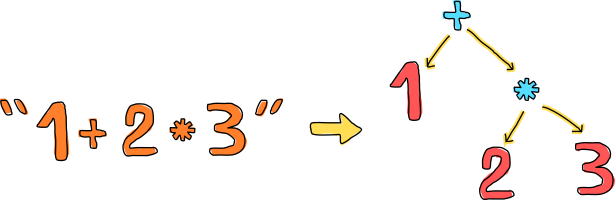

# Haskell - Analizadores sintácticos monádicos

Un **analizador sintáctico** es un programa que analiza cadenas de símbolos y permite transformarlas en algún tipo de representación interna. En programación funcional, una **mónada** es una estructura que representa una forma de computación y que favorece la programación con efectos de forma genérica. Los analizadores sintácticos son uno de los muchos problemas que las mónadas ayudan a simplificar.

_**Nota.** En este artículo se asume que el lector tiene familiaridad con las clases de funtores aplicativos y mónadas en Haskell._

## Analizadores sintácticos

Aquí, definiremos un analizador sintáctico como una función que toma una cadena de caracteres -la entrada que debe ser analizada- y que **posiblemente** devuelve un par formado por el valor analizado -la representación interna- y el resto de la cadena que queda por analizar.

```haskell
newtype Parser a = Parser { runParser :: String -> Maybe (a, String) }
```

Es frecuente que las librerías de análisis parametricen además el tipo de entrada `s` que se consume, en lugar de fijarla a `String`. También es frecuente devolver una lista de resultados `[(a, s)]` en lugar de `Maybe (a, s)`, permitiendo así que el proceso de análisis sea no determinista. No obstante, por simplicidad, en este artículo  nos centraremos en el tipo `String` y usaremos la mónada `Maybe` en lugar de `[]`, que será suficiente para representar un proceso de análisis semi-determinista donde la entrada puede fallar o ser analizada de una única forma.

___
**Ejemplo 1.** La función `sat` toma como argumento un predicado (en `Char`) y devuelve un analizador que consume el primer carácter de la entrada si este satisface el predicado:

```haskell
sat :: (Char -> Bool) -> Parser Char
sat p = Parser $ \input -> case input of
    []     -> Nothing
    (x:xs) -> if p x then Just (x, xs)
                     else Nothing
```

```haskell
ghci> runParser (sat isDigit) "123"
Just ('1', "23")

ghci> runParser (sat isDigit) "a123"
Nothing
```

Partiendo de `sat` podemos construir otras funciones básicas como `char`, que recibe un carácter `c` y devuelve un analizador que tiene éxito si el siguiente carácter de la cadena es `c`, o `next`, que consume el siguiente carácter sea cual sea:

```haskell
char :: Char -> Parser Char
char c = sat (== c)

next :: Parser Char
next = sat (const True)
```

```haskell
ghci> runParser (char 'b') "bar"
Just ('b', "ar")

ghci> runParser (char 'o') "foo"
Nothing

ghci> runParser next "foo"
Just ('f', "oo")

ghci> runParser next ""
Nothing
```
___

## Análisis aplicativo

En ocasiones es necesario transformar el posible valor generado por un analizador. Esto es exactamente lo que permite la función `fmap` de la instancia de `Functor` de un analizador: aplicar una función al resultado del análisis, si tiene éxito.

```haskell
instance Functor Parser where
    fmap f p = Parser $ \input -> case runParser p input of
        Nothing -> Nothing
        Just (x, xs) -> Just (f x, xs)
```

De forma más general, será necesario poder aplicar una función a dos o más posibles valores generados por analizadores. Esto es lo que hace la función `<*>` de la instancia de `Applicative` de un analizador: aplicar secuencialmente la posible función generada por un analizador a un posible valor generado por otro analizador.

```haskell
instance Applicative Parser where
    pure x = Parser $ \input -> Just (x, input)
    pf <*> px = Parser $ \input -> case runParser pf input of
        Nothing -> Nothing
        Just (f, xs) -> case runParser px xs of
            Nothing -> Nothing
            Just (x, xs') -> Just (f x, xs')
```

___
**Ejemplo 2.** La función `pair` recibe dos analizadores sintácticos, uno que analiza datos del tipo `a` y otro que analiza datos del tipo `b`, y devuelve un analizador que consume una tupla `(a,b)`.

```haskell
pair :: Parser a -> Parser b -> Parser (a,b)
pair p q = (,) <$> (char '(' *> p <* char ',') <*> (q <* char ')') 
```

```haskell
ghci> let digit = fmap (read . pure) (sat isDigit) :: Parser Int

ghci> runParser (pair digit digit) "(1,2)"
Just ((1,2), "")

ghci> runParser (pair digit next) "(1,a)"
Just ((1,'a'), "")
```
___

## Fallos y alternativas


Es conveniente introducir un combinador para manejar fallos y alternativas, de forma que sea posible lanzar un analizador y, si este no tiene éxito, ejecutar otro en su defecto. Esto es lo que hace la función `<|>` de la instancia `Alternative` de un analizador.

```haskell
instance Alternative Parser where
    empty = Parser $ const Nothing
    p <|> q = Parser $ \input -> case runParser p input of
        Nothing -> runParser q input
        Just (x, xs) -> Just (x, xs)
```

Esta clase nos da acceso a dos funciones realmente útiles para el análisis sintáctico:

* `many` toma un analizador `p` de un tipo `a` y devuelve un analizador del tipo `[a]` que aplica **cero o más veces** el analizador `p`.
* `some` toma un analizador `p` de un tipo `a` y devuelve un analizador del tipo `[a]` que aplica **una o más veces** el analizador `p`.

___
**Ejemplo 3.** Un número natural es una secuencia **no nula** de dígitos. Podemos utilizar el combinador `some` para consumir uno o más dígitos numéricos de la entrada, y transformar la cadena resultante a un entero mediante `fmap` (o su versión infija `<$>`).

```haskell
natural :: Parser Int
natural = read <$> some (sat isDigit)
```

```haskell
ghci> runParser natural "123foo"
Just (123, "foo")

ghci> runParser natural "bar"
Nothing
```
___

La interfaz de funtor aplicativo es lo suficientemente expresiva para analizar  gramáticas libres de contexto. Una **gramática libre de contexto** es una gramática formal en la que cada regla de producción es de la forma `A → α`, donde `A` es un símbolo no terminal y `α` es una cadena de símbolos terminales y no terminales. El término libre de contexto se refiere al hecho de que el símbolo no terminal `A` siempre puede ser reemplazado por `α` sin tener en cuenta el contexto en el que ocurra.

___
**Ejemplo 4.** Supongamos que queremos analizar expresiones aritméticas que contienen números naturales, sumas (`+`), productos (`*`) y paréntesis `(` y `)` para agrupar expresiones, con la precedencia usual de los operadores, pero **sin asociatividad**, generando un árbol de análisis que defina la estructura de la expresión aritmética analizada.



```haskell
data Expr = Val Int
          | Add Expr Expr
          | Mul Expr Expr
          deriving Show
```

La gramática libre de contexto correspondiente es la siguiente:

* `<Expr> → <Factor> "+" <Factor> | <Factor>`
* `<Factor> → <Term> "*" <Term> | <Term>`
* `<Term> → "(" <Expr> ")" | <Natural>`

donde `|` es un operador usado para separar múltiples opciones para un mismo no terminal.

```haskell
natural :: Parser Int
natural = read <$> some (sat isDigit)

expr :: Parser Expr
expr = (Add <$> (factor <* char '+') <*> factor) <|> factor

factor :: Parser Expr
factor = (Mul <$> (term <* char '*') <*> term) <|> term

term :: Parser Expr
term = (char '(' *> expr <* char ')') <|> (Val <$> natural)
```

```haskell
ghci> runParser expr "2*3+4*5"
Just (Add (Mul (Val 2) (Val 3)) (Mul (Val 4) (Val 5)),"")

ghci> runParser expr "(1+2)*(3+4)"
Just (Mul (Add (Val 1) (Val 2)) (Add (Val 3) (Val 4)),"")

ghci> runParser expr "(1+2)+3"
Just (Add (Add (Val 1) (Val 2)) (Val 3),"")

ghci> runParser expr "1+2+3"  
Just (Add (Val 1) (Val 2),"+3")
```
___

## Análisis monádico

Para analizar algunas gramáticas es necesario extraer el valor generado por un analizador, y pasarlo como parámetro a una función que devuelva otro analizador. De esto se encarga la función lazo `>>=` de la instancia de `Monad` de un analizador.

```haskell
instance Monad Parser where
    p >>= f = Parser $ \input -> case runParser p input of
        Nothing -> Nothing
        Just (x, xs) -> runParser (f x) xs
```

___
**Ejemplo 5.** Ahora queremos analizar las mismas expresiones aritméticas del Ejemplo 4, pero respetando la asociatividad usual de los operadores (por la izquierda). La gramática correspodiente es la siguiente:

* `<Expr> → <Expr> "+" <Factor> | <Factor>`
* `<Factor> → <Factor> "*" <Term> | <Term>`
* `<Term> → <Natural> | "(" <Expr> ")"`

Dado que esta gramática es recursiva por la izquierda, y el proceso de análisis también lo es, se hace necesario eliminar la recursividad de la gramática, transformándola a otra equivalente:

* `<Expr> → <Factor> <Expr'>`
* `<Expr'> → "+" <Factor> <Expr'> | ε`
* `<Factor> → <Term> <Expr'>`
* `<Factor'> → "*" <Term> <Factor'> | ε`
* `<Term> → <Natural> | "(" <Expr> ")"`

donde `ε` representa la producción nula.

```haskell
natural :: Parser Int
natural = read <$> some (sat isDigit)

expr :: Parser Expr
expr = do x <- factor
          expr' x

expr' :: Expr -> Parser Expr
expr' x = (do char '+'
              y <- factor
              expr' (Add x y)) <|> return x

factor :: Parser Expr
factor = do x <- term
            factor' x

factor' :: Expr -> Parser Expr
factor' x = (do char '*'
                y <- term
                factor' (Mul x y)) <|> return x

term :: Parser Expr
term = (do char '('
           x <- expr
           char ')'
           return x) <|> (Val <$> natural)
```

Nótese cómo ahora no es necesario utilizar paréntesis para asociar dos o más sumas o productos:

```haskell
ghci> runParser expr "1+2+3"      
Just (Add (Add (Val 1) (Val 2)) (Val 3),"")

ghci> runParser expr "(1+2+3)*(4+5+6)*7"
Just (Mul (Mul (Add (Add (Val 1) (Val 2)) (Val 3)) (Add (Add (Val 4) (Val 5)) (Val 6))) (Val 7),"")
```
___

## Referencias

* Hutton, G., & Meijer, E. (1998). **Monadic parsing in Haskell**. *Journal of functional programming*, *8*(4), 437-444.
* Hutton, G. (2016). Monadic parsing. In **Programming in Haskell** (pp. 177-195). Cambridge: Cambridge University Press.
