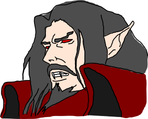

# Prolog - Gramáticas de cláusulas definidas
> Procesamiento de gramáticas formales

Las **gramáticas de cláusulas definidas** (**DCG's**) permiten representar una gramática formal como un conjunto de cláusulas definidas en una lógica de primer orden. Estas DCG's proporcionan a los lenguajes de programación lógicos como Prolog una forma conveniente y efectiva de expresar gramáticas, resultando especialmente útiles en el **procesamiento** de **lenguajes naturales** y de **lenguajes formales**.

***Nota.*** *Como veremos a continuación, las DCG's están muy relacionadas con las **listas abiertas** y las **listas diferencia**. Puedes leer el artículo [Prolog - Estructuras de datos incompletas](https://github.com/jariazavalverde/blog/blob/master/posts/prolog/estructuras-de-datos-incompletas.md) para obtener más información sobre estas.*

## Sintaxis

Una **gramática formal** es una estructura matemática con un conjunto de reglas de producción que definen las cadenas admisibles en un determinado lenguaje formal o lenguaje natural.

___
**Ejemplo 1.** Un sencillo ejemplo ayuda a ilustrar qué son estas DCG's y para qué sirven. En gramática, decimos que una oración está formada por un sujeto (un sintagma nominal) y un predicado (un sintagma verbal). Un sintagma nominal está formado a su vez por un sustantivo posiblemente precedido por un determinante, y un sintagma verbal está formado por un verbo y un sintagma nominal.

```prolog
oracion -->
    sintagma_nominal,
    sintagma_verbal.

sintagma_nominal -->
    determinante,
    sustantivo.
sintagma_nominal -->
    sustantivo.

sintagma_verbal -->
    verbo,
    sintagma_nominal.
```

Declaramos los determinantes `los` y `un`, los verbos `tienen` y `matan`, y los sustantivos `belmont`, `vampiros` y `colmillos`.

```prolog
determinante --> [los].
determinante --> [un].

sustantivo --> [belmont].
sustantivo --> [vampiros].
sustantivo --> [colmillos].

verbo --> [matan].
verbo --> [tienen].
```



Ahora, esta gramática nos permite comprobar si determinadas cadenas son correctas o no, como por ejemplo, `los vampiros tienen colmillos` o `los belmont matan vampiros`. Más aún, esta gramática puede ser utilizada para derivar, por reevaluación, todas las cadenas permitidas por el lenguaje descrito.

```prolog
?- oracion([los, belmont, matan, vampiros], []).
true.

?- oracion([tienen, colmillos, vampiros], []).
false.
```
___

Como vemos en el ejemplo anterior, las producciones de la gramática se definen en Prolog mediante reglas de la forma `Cabeza --> Cuerpo`, donde la cabeza representa un símbolo no terminal de la gramática y el cuerpo es una cadena de símbolos terminales y no terminales. Un símbolo **terminal** se expresa en Prolog como una lista, que representa los elementos que contiene. Un símbolo **no terminal** se refiere a otra construcción de la gramática, que representa los elementos que ella misma describe.

En realidad, esta notación de DCG es simplemente azúcar sintáctico para las cláusulas definidas normalmente en Prolog. Aquí es donde entran en juego las listas abiertas y las listas diferencia.

___
**Ejemplo 2.** Podemos expresar la gramática anterior como un conjunto de cláusulas Prolog estándar de la siguiente forma. En estos predicados, la primera lista contiene los elementos que se deben analizar, y cada uno busca lo que necesita al frente de la primera lista, unificando la segunda lista con lo que queda por analizar. Por ejemplo, cuando `oracion/2` busca un sintagma nominal en `[los, belmont, matan, vampiros]`, `sintagma_nominal/2` encuentra `[los, belmont]` y deja el resto de la lista, `[matan, vampiros]`, para que ahora `sintagma_verbal/2` busque un predicado. Como el predicado es `[matan, vampiros]`, ahora `sintagma_verbal/2` deja una lista vacía `[]` como resto por analizar, y como `sintagma_verbal/2` era el último símbolo de la regla `oracion/2`, `oracion/2` deja por analizar esa misma lista vacía.

```prolog
oracion(L1, L3) :-
    sintagma_nominal(L1, L2),
    sintagma_verbal(L2, L3).

sintagma_nominal(L1, L3) :-
    determinante(L1, L2),
    sustantivo(L2, L3).
sintagma_nominal(L1, L2) :-
    sustantivo(L1, L2).

sintagma_verbal(L1, L3) :-
    verbo(L1, L2),
    sintagma_nominal(L2, L3).

determinante([los|L], L).
determinante([un|L], L).

sustantivo([belmont|L], L).
sustantivo([vampiros|L], L).
sustantivo([colmillos|L], L).

verbo([matan|L], L).
verbo([tienen|L], L).
```

Por lo tanto, cuando lanzamos el objetivo `oracion([...], [])` estamos preguntando si es posible analizar por completo todos los símbolos de la primera lista mediante esa regla.
___

Cada vez que introducimos una regla de producción `Cabeza --> Cuerpo` en un intérprete de Prolog, este transforma la sintaxis de DCG a una cláusula Prolog estándar de la forma que acabamos de ver.

## Gramáticas libres de contexto

Una **gramática libre de contexto** es una gramática formal en la que cada regla de producción es de la forma `A → α`, donde `A` es un símbolo no terminal y `α` es una cadena de símbolos terminales y no terminales. El término libre de contexto se refiere al hecho de que el símbolo no terminal `A` siempre puede ser reemplazado por `α` sin tener en cuenta el contexto en el que ocurra.

Estas son prácticamente las mismas palabras que acabamos de utilizar para describir las gramáticas de cláusulas definidas de Prolog. Esto es porque las DCG's tal y como las hemos visto hasta el momento, sólo permiten analizar lenguajes libres de contexto.

___
**Ejemplo 3.** Una simple gramática libre de contexto formada por las siguientes reglas de producción:

* `<A> → "a" <A> | <B>`
* `<B> → "b" <B> | <C>`
* `<C> → "c" <C> | ε`

genera el lenguaje `{a*b*c*}`, donde `|` es un operador usado para separar múltiples opciones para un mismo no terminal, los símbolos `A`, `B` y `C` son no terminales, los símbolos `a`, `b` y `c` son terminales, y `ε` indica una cadena vacía.

Podemos expresar esta gramática en Prolog con DCG's tal y como hicimos anteriormente. Vemos que en Prolog la producción vacía `ε` se corresponde con una lista vacía `[]`.

```prolog
a --> [a], a.
a --> b.
b --> [b], b.
b --> c.
c --> [c], c.
c --> [].
```

Tal y como esperábamos, podemos generar cadenas con cualquier número de símbolos `a`, `b` y `c`, en ese orden.

```prolog
?- a([a,b,c], []).
true.

?- a([a,a,a,b,b,c], []).
true.

?- a([b,a,c], []).
false.
```
___

Las gramáticas libres de contexto son simples y permiten describir la sintaxis de la mayoría de los lenguajes de programación. No obstante, no son lo suficientemente expresivas para describir cualquier lenguaje formal. Supongamos que en lugar de generar el lenguaje `{a*b*c*}` estuviésemos interesados en generar cadenas con el mismo número de terminales `a`, `b` y `c`, es decir, el lenguaje `{aⁿbⁿcⁿ : n>0}`. Para ello, debemos recurrir a las gramáticas sensibles al contexto.

## Gramáticas sensibles al contexto

Una **gramática sensible al contexto** es una gramática formal en la que cada regla de producción es de la forma `α → β`, donde `α` y `β` son cadenas de símbolos terminales y no terminales que no permiten producciones vacías (`ε`).

___
**Ejemplo 4.** La gramática sensible al contexto formada por las siguientes reglas de producción:

* `<A> → "abc" | "a" <A> <B> "c"`
* `"c" <B> → <B> "c"`
* `"b" <B> → "bb"`

genera el lenguaje `{aⁿbⁿcⁿ : n>0}`, donde los símbolos `A`, `B` y `C` son no terminales y los símbolos `a`, `b` y `c` son terminales.

En Prolog, no podemos trasladar directamente estas gramáticas sensibles al contexto a la sintaxis de DCG's, pero sí podemos conseguir una expresividad similar añadiendo parámetros adicionales a las reglas de producción de las gramáticas.

En la siguiente DCG hemos añadido un parámetro adicional a las reglas de producción, para indicar el número de símbolos a analizar. Si bien antes estas reglas eran traducidas a cláusulas Prolog estándar con 2 argumentos, ahora son traducidas a cláusulas con 3 argumentos (2 argumentos para las listas abiertas y 1 para nuestro parámetro adicional). También es importante observar que podemos invocar predicados Prolog arbitrarios en medio de las reglas de producción, encerrando estas llamadas en el término `{}/1`. De esta forma, le indicamos al intérprete que esas regiones de código no forman parte de la gramática y por lo tanto no deben ser traducidas a la sintaxis de listas abiertas.

```prolog
s(N) --> a(N), {N > 0}, b(N), c(N).

a(N) --> [a], a(M), {succ(M, N)}.
a(0) --> [].

b(N) --> [b], b(M), {succ(M, N)}.
b(0) --> [].

c(N) --> [c], c(M), {succ(M, N)}.
c(0) --> [].
```

```prolog
?- s(X, [a,a,b,b,c,c], []).
X = 2.

?- s(X, [a,a,a,b,b,b,c,c,c], []).
X = 3.

?- s(X, [a,b,b,c,c,c], []).
false.
```
___

## Árboles de análisis

El uso más práctico y común de los parámetros adicionales en las gramáticas de cláusulas definidas es el de capturar información sobre el proceso de análisis de una cadena para construir su árbol de análisis.

___
**Ejemplo 5.** La siguiente gramática analiza expresiones aritméticas formadas por números naturales, paréntesis y los operadores binarios `+` y `*` (sin asociatividad).

* `<Expresion> → <Factor> "+" <Factor> | <Factor>`
* `<Factor> → <Termino> "*" <Termino> | <Termino>`
* `<Termino> → natural | "(" <Expresion> ")"`

A continuación se muestra una posible implementación de esta gramática en Prolog, que permite analizar cadenas generadas por este lenguaje, proporcionando además un árbol de análisis de la expresión analizada, donde:

* `digito//1` analiza un carácter y comprueba que es un dígito,
* `digitos//1` analiza una secuencia de dígitos,
* `natural//1` analiza una secuencia no nula de dígitos y la convierte en un número,
* `termino//1` analiza un número natural o una expresión entre paréntesis,
* `factor//1` analiza un producto de términos o un término,
* y `expresion//1` analiza una suma de factores o un factor.

```prolog
digito(X) --> [X], {char_code(X, C), C >= 48, C =< 57}.

digitos([X|Xs]) --> digito(X), !, digitos(Xs).
digitos([]) --> [].

natural(X) --> digitos(Xs), {Xs \= [], number_chars(X, Xs)}.

termino(X) --> natural(X).
termino(X) --> ['('], expresion(X), [')'].

factor(mul(X,Y)) --> termino(X), [*], termino(Y).
factor(X) --> termino(X).

expresion(add(X,Y)) --> factor(X), [+], factor(Y).
expresion(X) --> factor(X).
```

```prolog
?- atom_chars('3098', C), expresion(X, C, []).
X = 3098.

?- atom_chars('15+32', C), expresion(X, C, []).
X = add(15, 32).

?- atom_chars('102*34+22*35', C), expresion(X, C, []).
X = add(mul(102, 34), mul(22, 35)).

?- atom_chars('(102*(34+22))*35', C), expresion(X, C, []).
X = mul(mul(102, add(34, 22)), 35).
```
___
